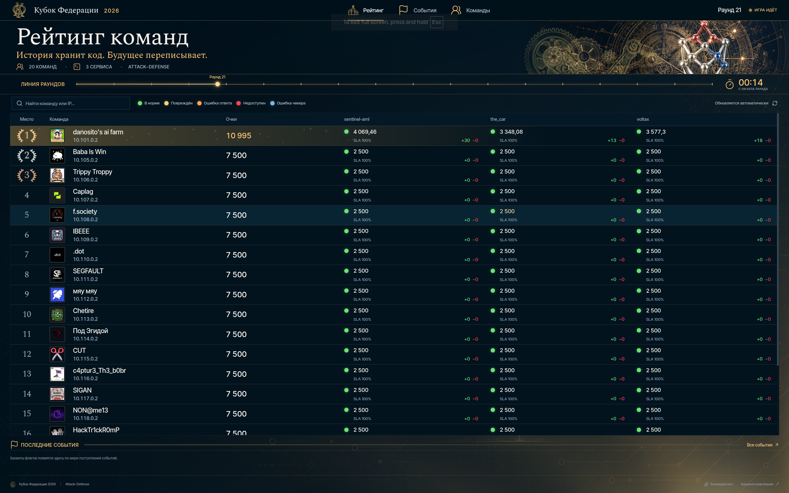

# ForcAD



Pure-python distributable Attack-Defence CTF platform, created to be easily set up.

The name is pronounced as "forkád".

> This documentation is for the latest (development) version of ForcAD. It might not be stable or even working. The latest stable version can be found [here](https://github.com/pomo-mondreganto/ForcAD/releases/latest), see the README.md there.

Note that there's a [wiki](https://github.com/pomo-mondreganto/ForcAD/wiki) containing some useful queries for game
statistics, services description, writing a checker, modifying the rating system, etc.

## Table of contents

<!-- toc -->

* [Running](#running)

* [Configuration and usage](#configuration-and-usage)
    * [Receiving flags](#receiving-flags)
    * [Flag format](#flag-format)
    * [Configuration file](#configuration-file)

* [Checkers](#checkers)
    * [Configuration](#configuration)
    * [Checkers folder](#checkers-folder)
    * [Writing a checker](#writing-a-checker)

* [Wiki](#wiki)

<!-- tocstop -->

## Running

5 easy steps to start a game (assuming current working directory to be the project root):

1. Open `config.yml` file (or `cp config.yml.example config.yml`, if the latter is missing).

2. Add teams and tasks to corresponding config sections following the example's format, set `start_time`, `timezone`
   (e.g. `Europe/Moscow`) and `round_time` (in seconds) (for recommendations see [checker_timeout](#checkers) variable).

3. Install `cli/requirements.txt` (`pip3 install -r cli/requirements.txt`)

4. Run `./control.py setup` to prepare ForcAD config. This command will generate a new login and password
   (if not provided in `admin.username` and `admin.password`) for the admin interface and services. Generated
   credentials will appear in command output and in the updated `config.yml`. Backup of the config file will be
   generated just in case.

5. Run `./control.py start --fast` to start the system. Wait patiently for the images to build, it could take a few
   minutes, but happens only once. Notice that `--fast` option uses the pre-built image, so if you modified the base
   images or backend requirements, omit this option to run the full build.

That's all! Now you should be able to access the scoreboard at `http://127.0.0.1:8080/`. Admin panel is accessible at
`http://127.0.0.1:8080/admin/`. Celery visualization (flower) is at `http://127.0.0.1:8080/flower/`.

> Before each new game run `./control.py reset` to delete old database and temporary files (and docker networks)

### Reset and cleanup

These commands delete game data. Back up a game you need to retain before running them.

| Command | Result | Next step |
| --- | --- | --- |
| `./control.py reset` | Stops game services, clears game tables and Redis, removes containers and Compose volumes. Keeps the PostgreSQL cluster and its credentials. | `./control.py start` |
| `./control.py reset --full` | Removes the local PostgreSQL cluster as well, including its old credentials. Keeps `config.yml`, generated environment files and checkers. | `./control.py start` |
| `./control.py clean` | Performs a full local reset, then removes generated environment files and `docker-compose-base.yml`. Keeps `config.yml` and checkers. | `./control.py setup`, then `./control.py start` |

Add `--fast` if the deployment uses the fast Compose images. Cleanup preserves Docker images and build cache.
After updating this fork, run `./control.py build` (or `./control.py build --fast`) to apply changes to the
database reset script inside the initializer image.
Configured team tokens remain in `config.yml` and are reused on initialization. Teams without configured tokens
receive new random tokens.

When changing the database credentials for a new game:

```bash
./control.py reset --full
# Edit admin credentials and game settings in config.yml.
./control.py setup
./control.py start
```

Full cleanup also works when `setup` has already changed the password and the old database rejects connections:
it does not log in to PostgreSQL. It uses the cached PostgreSQL image to remove the container-owned data, so no
manual `sudo rm` is needed. Full cleanup requires a local Unix-socket Docker daemon supporting
`bind-recursive=disabled` and the standard `docker_volumes/postgres/data` bind mount.
External storages and custom PostgreSQL mounts are supported by ordinary `reset`, but not by `reset --full` or
`clean`. Those commands refuse unsupported storage layouts before stopping services.

Cleanup refuses symlinked storage paths and nonempty data directories without a regular `PG_VERSION` file.
It leaves unrelated files in `docker_volumes` and empty parent directories in place. Repeating `clean` after a
successful cleanup is safe. If generated configuration is missing while game data or containers remain, run
`setup` to restore it before cleanup.

Failures return a nonzero exit status and do not print a success message. If ordinary `reset` fails, the game
services remain stopped for diagnosis. Storage connection retries and SQL execution have time limits.

## Configuration and usage

### Receiving flags

Teams are identified by tokens. Set `teams[].token` to reuse a token after a full reset, or omit it to generate a
random token each time the database is initialized. Look for them in the logs of `initializer`
container or print using the following command after the system started: `./control.py print_tokens`. Token is private
information, so send them to each team correspondingly.

### Flag format

System uses the most common flag format by default: `[A-Z0-9]{31}=`, the first symbol is the first letter of
corresponding service name. You can change flag generation in function `Flag.generate` in
[backend/lib/models/flag.py](backend/lib/models/flag.py)

Each flag is valid (received by flag receivers and can be checked by checker) for `flag_lifetime` rounds (game config
variable).

### Configuration file

Config file (`config.yml`) is split into five main parts:

* **game** contains the following settings:

    * `start_time` (required): the datetime of game start (timezone will be taken from the `timezone` option).
      Example: `2019-11-30 15:30:00`.

    * `round_time` (required): round duration in seconds. Example: `30`.

    * `rounds` (optional, default unlimited): positive integer limiting the number of playable rounds.
      With `rounds: 300` and `round_time: 60`, the game finishes at the boundary after round 300,
      without starting round 301. This is five hours without pauses or checker delays.
      Pauses preserve the remaining round time; unfinished checks can delay earlier round transitions.
      At the final boundary, flag reception and new checks stop. Already sent checks can finish
      before the final scoreboard is published. The limit applies to scheduled games, manually
      started finals and rehearsals. Each new session starts its round count from one;
      rehearsals retain their cleanup behavior.
      Omit `rounds` or set it to `null` to disable this automatic limit.

    * `flag_lifetime` (required): flag lifetime in rounds (see [flag format](#flag-format) section). Example: `5`.

    * `timezone` (optional, default `UTC`): the timezone in which `start_time` is specified. Example: `Europe/Moscow`.

    * `default_score` (optional, default `2500`): default score for tasks.

    * `env_path` (optional): string to append to checkers' `$PATH` environment variable
      (see [checkers](#checkers) section). Example: `/checkers/bin/`.

    * `game_hardness` (optional, default `10`): game hardness parameter
      (see [rating system](https://github.com/pomo-mondreganto/ForcAD/wiki/Rating-system) wiki page). Example: `10.5`.

    * `inflation` (optional, default `true`): inflation
      (see [rating system](https://github.com/pomo-mondreganto/ForcAD/wiki/Rating-system) wiki page). Example: `true`.

    * `checkers_path` (optional, default `/checkers/`): path to checkers inside Docker container. Do not change unless
      you've changed the `celery` image.

    * `volga_attacks_mode` (optional, default `false`): refuse to accept flags if the attacker's service is down.

* **admin** contains credentials to access celery visualization (`/flower/` on scoreboard) and admin panel:

    * `username: forcad`
    * `password: **change_me**`

    It will be auto-generated if missing. Usernames & passwords to all storages will be the same as to the admin panel.

* **teams** contains playing teams. Example contents:

```yaml
teams:
  - ip: 10.70.0.2
    name: Team1
  - ip: 10.70.1.2
    name: "Team2 (highlighted)"
    highlighted: true
```

Highlighted teams will be marked on the scoreboard with a rainbow border.

Each team can optionally specify a fixed token:

```yaml
teams:
  - ip: 10.70.0.2
    name: Team1
    token: "0123456789abcdef"  # Example only; use your own random token.
  - ip: 10.70.1.2
    name: Team2
```

Tokens must be unique strings of exactly 16 lowercase hexadecimal characters (`0-9`, `a-f`).
Quote tokens in YAML, especially values containing only digits. `control.py setup` preserves configured tokens.
After `control.py reset` and the next start, Team1 receives its configured token and Team2 receives a new random
token. An omitted token or `token: null` uses the original random generation; generated tokens are not saved to
the YAML. Empty strings and invalid or duplicate tokens are rejected.

These settings apply when initializing a fresh database. Editing the YAML and restarting an already initialized
game does not change its stored tokens. Keep the configuration and its backups private, and distribute only each
team's own token. After installing this change, rebuild the initializer image before starting the new game.

* **tasks** contains configuration of checkers and task-related parameters. More detailed explanation is
  in [checkers](#checkers) section. Example:

```yaml
tasks:
  - checker: collacode/checker.py
    checker_type: pfr
    checker_timeout: 30
    default_score: 1500
    gets: 3
    name: collacode
    places: 1
    puts: 3

  - checker: tiktak/checker.py
    checker_type: hackerdom
    checker_timeout: 30
    gets: 2
    name: tiktak
    places: 3
    puts: 2
```

* **storages** is an **auto-generated section**, which will be overridden by `control.py <setup>/<kube setup>` and describes
  settings used to connect to PostgreSQL, Redis and RabbitMQ:

    * `db`: PostgreSQL settings:

        * `user: <admin.username>`
        * `password: <admin.password>`
        * `dbname: forcad`
        * `host: postgres`
        * `port: 5432`

    * `redis`: Redis (cache) settings:

        * `password: <admin.password>`
        * `db: 0`
        * `host: redis`
        * `port: 6379`

    * `rabbitmq`: RabbitMQ (broker) settings:

        * `user: <admin.username>`
        * `password: <admin.password>`
        * `host: rabbitmq`
        * `port: 5672`
        * `vhost: forcad`

For those familiar with Python typings, formal definition of configuration can be found [here](cli/models.py)
. `BasicConfig` describes what is required before `setup`
cli command is called, and `Config` describes the full configuration.

### Applying a round limit to an existing game

For a new database, `game.rounds` is loaded by the initializer. An existing database
keeps its stored configuration when containers restart. To apply the limit without
resetting teams, tokens, scores or history, edit `game.rounds` in `config.yml`, then
run these commands from the project directory with the database and Redis running:

```bash
python control.py rd build
python control.py rd run --rm --no-deps config-loader
python control.py rd run --rm --no-deps initializer \
  python -m scripts.apply_fixes --config /run/forcad-config/config.yml
python control.py rd up -d
```

The migration applies only `game.rounds` from that file. It preserves `start_time`
and the current lifecycle; a finished official game stays finished. Missing or null
`rounds` removes the limit. Running `scripts.apply_fixes` without `--config` only
updates the schema and preserves the stored limit. A limit at or below the current
round finishes a running game at its next round boundary.

### Starting a rehearsal or final from the admin page

Before the scheduled start, `/admin/` offers two separate controls:

* **Начать тестовую игру** starts a rehearsal. **Завершить тестовую игру**, the round
  limit, or the configured start date ends it. After outstanding checks finish, test
  scores, flags and history are cleared. Teams, tokens and settings are kept.
* **Начать финал** starts the official game immediately, even when `start_time` is
  in the future. Finish the rehearsal and wait for cleanup before starting the final.
  The final starts at round one and uses the configured `rounds` limit independently
  of the rehearsal. **Завершить игру** or the round limit ends the final and preserves
  its results. A finished final cannot be resumed; use pause for a temporary break.

The manual final start is stored in PostgreSQL. Restarting containers or reaching
the configured start date does not reset or restart that final. If no final is
started manually, the existing scheduled start still applies. The legacy
`POST /api/admin/game/start/` retains its date-based behavior; the new controls use
`start_practice/` and `start_final/`. The latter requires `confirm: true`, as does
`finish/`. The UI sends the session generation to reject stale commands.

For an existing installation, build the updated images and apply the additive
session migration before recreating the services, with PostgreSQL and Redis running:

```bash
python control.py rd build
python control.py rd run --rm --no-deps initializer python -m scripts.apply_fixes
python control.py rd up -d
```

This migration preserves the stored configuration and all existing results. It does
not convert a running rehearsal into a final. For a new database, initialization
creates the required session fields automatically.

## Checkers

### Configuration

Checksystem is completely compatible with Hackerdom checkers, but some config-level enhancements were added (see below).
Checkers are configured for each task independently. It's recommended to put each checker in a separate folder
under `checkers` in project root. Checker is considered to consist of the main executable and some auxiliary files in
the same folder.

The following options are supported:

* `name` (required): name of the service shown on the scoreboard.

* `checker` (required): path to the checker executable (relative to `checkers` folder), which needs to be **
  world-readable and world-executable** (run `chmod o+rx checker_executable`), as checkers are run with `nobody` as the
  user. It's usually `<service_name>/checker.py`.

* `checker_timeout` (required): timeout in seconds for **each** checker action. As there're at minumum 3 actions run
  (depending on `puts` and `gets`), it's recommended to set `round_time` at least 4 times greater than the maximum
  checker timeout if possible.

* `puts` (optional, default `1`): number of flags to put for each team for each round.

* `gets` (optional, default `1`): number of flags to check from the last `flag_lifetime` rounds
  (see [Configuration and usage](#configuration-and-usage) for lifetime description).

* `places` (optional, default `1`): large tasks may contain a lot of possible places for a flag, that is the number.
  It's randomized for each `put` in range `[1, places]` and passed to the checker's `PUT` and `GET` actions.

* `checker_type` (optional, default `hackerdom`): an option containing underscore-separated tags,
  (missing tags are ignored). Examples: `hackerdom` (hackerdom tag ignored, so no modifier tags are applied),
  `pfr` (checker with public flag data returned). Currently, supported tags are:

    * `pfr`: checker returns public flag data (e.g. username of flag user) from `PUT` action as a **public message**,
      private flag data (`flag_id`) as a **private message**, and **public message** is shown
      on `/api/client/attack_data` for participants. If checker does not have this tag, no attack data is shown for the
      task.

    * `nfr`: `flag_id` passed to `PUT` is also passed to `GET` the same flag. That way, `flag_id` is used to seed the
      random generator in checkers so it would return the same values for `GET` and `PUT`. Checkers supporting this
      options are quite rare (and old), so **don't use it** unless you're sure.

More detailed explanation of checker tags can be
found [in this issue](https://github.com/pomo-mondreganto/ForcAD/issues/18#issuecomment-618072993).

* `env_path` (optional): path or a combination of paths to be prepended to `PATH` env
  variable (e.g. path to chromedriver).

See more in [checker writing](#writing-a-checker) section.

### Checkers folder

`checkers` folder in project root (containing all checker folders) is recommended to have the following structure:

```yaml
checkers:
  - requirements.txt  <--   automatically installed (with pip) combined requirements of all checkers (must be present)
  - task1:
      - checker.py  <--   executable (o+rx)
  - task2:
      - checker.py  <--   executable (o+rx)
```

### Writing a checker

See the [corresponding wiki page](https://github.com/pomo-mondreganto/ForcAD/wiki/Writing-a-checker) on how to write a
checker.

## Wiki

More extensive reading can be found in the [wiki pages](https://github.com/pomo-mondreganto/ForcAD/wiki).
